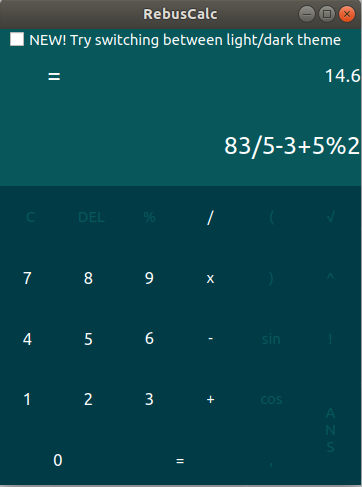
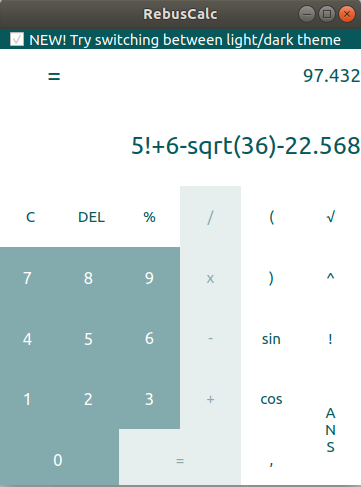

Rebus calc
---------

Environment
---------

Ubuntu 18.04.2 LTS

Authors
------

Rebus
- xjezik03 Andrej Ježík [xjezik03@stud.fit.vutbr.cz]
- xkubik34 Tibor Kubík  [xkubik34@stud.fit.vutbr.cz]
- xdubec01 Branislav Dubec  [xdubec01@stud.fit.vutbr.cz]
- xstrba05 Boris Štrbák [xstrba05@stud.fit.vutbr.cz]

Licence
-------

GNU GPL v.3 licence

Getting Started
---------------

RebusCalc is advanced app which helps you with daily mathematical problems but also due to it's advanced functionality you can use it for many other purposes as scientific calculation.

Installing
----------

Instalation is very simple. All you have to do is to open .deb file, which will install application automatically.

Contributing
------------

If you would like to enhance our project please contact us via e-mail: rebuscalc@gmail.com

